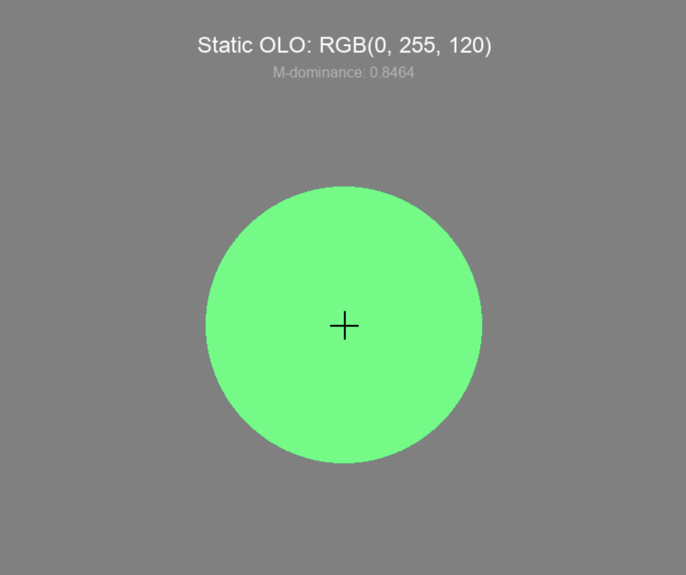

# olo-mimic
Attempt to create Olo color display based on [Novel color via stimulation of individual photoreceptors at population scale](https://pmc.ncbi.nlm.nih.gov/articles/PMC12007580/pdf/sciadv.adu1052.pdf) paper.

# virtual-env setup
python -m venv venv
source venv/bin/activate

# imports
pip install numpy pygame

# running
python olo_simulator.py

# results

